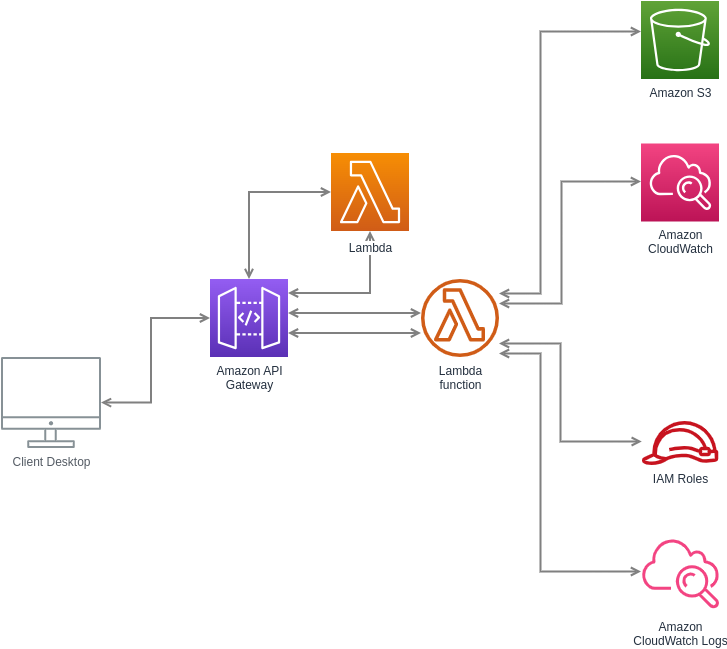

# Serverless API

## Architecture Diagram



## Design Choices

- **AWS Lambda**: Chosen for serverless compute and automatic scaling.
- **API Gateway**: Provides a RESTful API interface for the Lambda function.
- **CloudWatch**: Used for logging and monitoring.

## Local Development

For local development, ensure you have the AWS CLI and Terraform installed. Use LocalStack for a local AWS cloud stack.
| Key          | Value                                                                                                                                                                                                                                                                                                                                                                                                                                                                                                                                                                                                                                                                                                                                                                                                                                                                                                                                                                                                                                                                                                                                                                                                                                                                                              |
|--------------|----------------------------------------------------------------------------------------------------------------------------------------------------------------------------------------------------------------------------------------------------------------------------------------------------------------------------------------------------------------------------------------------------------------------------------------------------------------------------------------------------------------------------------------------------------------------------------------------------------------------------------------------------------------------------------------------------------------------------------------------------------------------------------------------------------------------------------------------------------------------------------------------------------------------------------------------------------------------------------------------------------------------------------------------------------------------------------------------------------------------------------------------------------------------------------------------------------------------------------------------------------------------------------------------------|
| Environment  | AWS
| Services     | S3, Lambda, API Gateway, Cloudwatch                                                                                                                                                                                                                                                                                                                                                                                                                                                                                                                                                                                                                                                                                                                                                                                                                                                                                                                                                                                                                                                                                                                                                                                                                                                                |
| Integrations | AWS SDK, AWS CLI, GitHub actions, pytest                                                                                                                                                                                                                                                                                                                                                                                                                                                                                                                                                                                                                                                                                                                                                                                                                                                                                                                                                                                                                                                                                                                                                                                                                                                           |
| Categories   | Serverless, Lambda function URLs, LocalStack developer endpoints, JavaScript, Python                                                                                                                                                                                                                                                                                                                                                                                                                                                                                                                                                                                                                                                                                                                                                                                                                                                                                                                                                                                                                                                                                                                                                                                 |                                                                                                                                                                                                                                                                                                                                                                                                                                                                                                                                                                                                                                                                                                                                                                                                                                                                                                                                                                                                                                                                                                                                                                                                                                                                                            |
| Level        | Intermediate                                                                                                                                                                                                                                                                                                                                                                                                                                                                                                                                                                                                                                                                                                                                                                                                                                                                                                                                                                                                                                                                                                                                                                                                                                                                                       |

## Introduction

This is a simple API to return fun facts about cloud computing along with current time.
Here's a short summary of AWS features used:
* S3 bucket for storing lambda code
* Lambda function
* Logging using Cloudwatch

Moreover, the repo includes a GitHub actions workflow to demonstrate how to run end-to-end tests of your AWS apps.
The GitHub workflow runs a set of integration tests using pytest.

## Prerequisites

### Dev environment

Make sure you use the same version as the Python Lambdas to make Pillow work.
If you use pyenv, then first install and activate Python 3.12

```bash
pyenv install 3.12
pyenv global 3.12
```

```console
% python --version
Python 3.12
```

Create a virtualenv and install all the development dependencies there:

```bash
python -m venv .venv
source .venv/bin/activate
pip install -r requirements-dev.txt
```

## Instructions

You can set up and deploy the sample application on LocalStack by executing the commands in the Makefile.

Next, execute `make install` to install needed dependencies.

After that, launch `make terraform-setup` to provision the infrastructure on AWS using terraform CLI.

### API Key Authentication

The API Gateway now requires an API key for access. An API key and usage plan have been configured in the Terraform setup. Ensure to include the API key in your requests to access the API.

1. Retrieve the API key after Terraform deployment:
```bash
terraform output api_key
```

2. Include the API key in your request headers:
```
x-api-key: YOUR_API_KEY
```

If you prefer, you can also follow these step-by-step instructions for a manual deployment.


### Terraform

To create the infrastructure using Terraform, run the following commands:

```shell
cd terraform
terraform init
terraform apply --auto-approve
```

#### Create the lambda

This lambda holds the application logic

```bash
(cd lambda/; rm -f lambda.zip; zip lambda.zip handler.py)
aws lambda create-function \
    --function-name cloud_facts_function \
    --runtime python3.12 
    --timeout 10 \
    --zip-file fileb://lambda/lambda.zip \
    --handler handler.handler \
    --role arn:aws:iam::000000000000:role/lambda-role \
    --environment Variables="{STAGE=local}"
```

Create the function URL:

```bash
aws lambda create-function-url-config \
    --function-name cloud_facts_function \
    --auth-type NONE
```

```bash
pytest tests/
```

### GitHub Action

The CI part -->.github/workflows/ci-cd.yml